## HAVEN - (Humanitarian Action for Vigilance Empowerment and Notification)

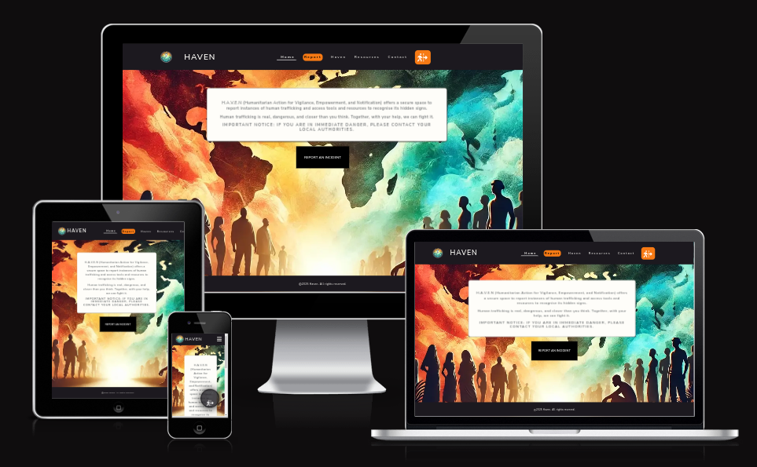

[View our live project](https://mikael-johnsson.github.io/hack-jan25-team3)

---

## Table of Contents

* [Criteria](#criteria)
* [UXD (User Experience Design) ](#user-experience-ux)
   * [User Stories](#user-stories)
   * [Wireframes](#wireframes)
* [Design](#design)
  * [Colour Scheme](#color-scheme)
  * [Typography](#typography)
* [Features](#features)
  * [Navbar](#navbar)
  * [Hero-Image](#hero-image)
  * [Footer](#footer)  
  * [Safety Button](#safety-button)
  * [Reporting Form](#reporting-form)
  * [Desktop View](#Desktop-view)
  * [Tablet View](#tablet-view)
  * [Mobile View](#mobile-view)
* [Goal](#goal)
* [Problem Statement](#problem-statement)
* [Target Audience](#target-audience)
* [Benefits](#Benefits)
* [Submission](#submission)
* [Deployment](#deployment)
* [Future Features](#future-features)
* [Technologies Used](#technologies-used)
  * [Languages Used](#languages-used)
  * [Frameworks, Libraries, Technologies & Programs Used](#frameworks-libraries-technologies--programs-used)
* [Testing](#testing)
  * [HTML Validation using W3C Validation](#html-validation-using-w3c-validation)
  * [CSS Validation using W3C Validation](#css-validation-using-w3c-validation)
  * [Lighthouse scores via Chrome Developer Tools](#lighthouse-scores-via-chrome-developer-tools)
* [Credits](#credits) 
* [Team](#team)

---

### **Criteria**  

1. Purpose and Focus
The website must aim to raise awareness about human trafficking and modern slavery.
It should focus primarily on human trafficking as the central issue.

2. User Safety
Include a "To Safety" button that redirects users to a different site and clears the last page in the browser history to ensure privacy and safety.
The feature must operate seamlessly to prevent detection by unauthorized parties.

3. Reporting Features
Provide a form for reporting human trafficking cases, usable by:
Individuals who are victims.
Witnesses or anyone aware of suspicious activities.
The form must include:
A text description field.
Options to upload supporting media such as photos or videos.
Integration with the What3Words API for precise geolocation input (within a 3m x 3m area).

4. Privacy and Consent
Allow users to specify whether they are comfortable being contacted after submitting a report.
Ensure the option for users to remain anonymous if desired.

5. Accessibility and Usability
The website must be intuitive and user-friendly, especially for individuals in high-stress situations.
Content and features should be accessible on both desktop and mobile devices.

6. Awareness and Engagement
Provide information and resources to educate users about the issue of human trafficking.
Include engaging and easy-to-understand content to increase user participation and awareness.

7. Team Collaboration
Ensure that the project reflects the combined [Contributors](#contributors) of all six team members.
Contributors should be recognized within the project documentation.

[Back to Table of Contents](#table-of-contents)

---

## User Experience (UX)  

### Primary Goal

Our primary goal is to create a safe, accessible, and educational resource that raises awareness about human trafficking, empowers individuals to report incidents, and provides tools to support victims and witnesses in taking action.

- This website serves a dual purpose:

    1. Education: It raises awareness about the prevalence and impact of human trafficking, providing valuable information and resources to inform and engage the public.

    2. Action and Safety: It offers a secure platform for users to report human trafficking cases, ensuring user privacy and safety through features like the "To Safety" button and anonymous reporting options.

### **First Time Users**

- New users can access educational resources about human trafficking to raise awareness and learn how they can help.

- New users will find a "To Safety" button that ensures privacy by redirecting them to another site and clearing their browsing history.

- New users can easily use the reporting form to provide information about  people needing help, with options to describe incidents, upload media, and share their precise location using the What3Words API.

- New users have the option to remain anonymous or provide contact details for follow-up communication after sending a  report.

### **Returning Users** 

- Returning users will find the same reliable "To Safety" button.

- Returning users can access educational resources and links to learn about new ways to contribute to the fight against human trafficking.

- Returning users can quickly submit additional reports using the familiar form.

- Returning users who provided contact information may receive follow-ups to assist with ongoing cases and asked if they can provide further informatiom.

[Back to Table of Contents](#table-of-contents)

---

## User Stories

User Stories
  

### User Story: API to connect form to database 
**Label:** Enhancement

---

### User Story: Form for organisations to sign-up as a safe place 
**Label:** Enhancement

---

### User Story: what3words map for modal 
**Label:** Should Have

---

### User Story: Readme 
**Label:** Documentation

---

### User Story: Team overview page
**Label:** Documentation

---

### User Story: Contact us section 
**Label:** Should Have

---

### User Story: Page that signposts to other resources for reporting/researching
**Label:** Should Have

---

### User Story: Create CRUD to append database SH
**Label:** Should Have

---

### User Story: Create database to link with the reported incidents
**Label:** Should Have

---

### User Story: Navigation & Footer
**Label:** Should Have

---

### User Story: Quick exit button
**Label:** Should Have

---

### User Story: Landing Page
**Label:** Must Have

---

### User Story: Images / Logos
**Label:** Should Have

---

### User Story: Decide on content
**Label:** Must Have

---

### User Story: Create wireframes
**Label:** Must Have

---

### User Story: User Story: Report form
**Label:** Must Have

> **As a** user, 
> **I want to** be able to report an incident, 
> **so that** the authorities could be notified.

### Acceptance Criteria:
- A report form is easily accessed from the landing page.
- In the report, I can submit a description of the incident, images or videos, and a place on a map of where the incident occurred.
- If emergency, I get a notice to contact authorities.
- For later on filtering, I can add information about the reporter, the victim, and the incident type.
- I have the option to submit my personal information to be able to be contacted by the authorities as a witness.

### Tasks:
1. Add a modal containing the report.
2. Create functionality to hide/display the form's pages.
3. Create functionality to gather the forms in a backend.

---

### User Story: Favicons and title
**Label:** Setup

---

 

[Back to Table of Contents](#table-of-contents)

---

### Projectboard
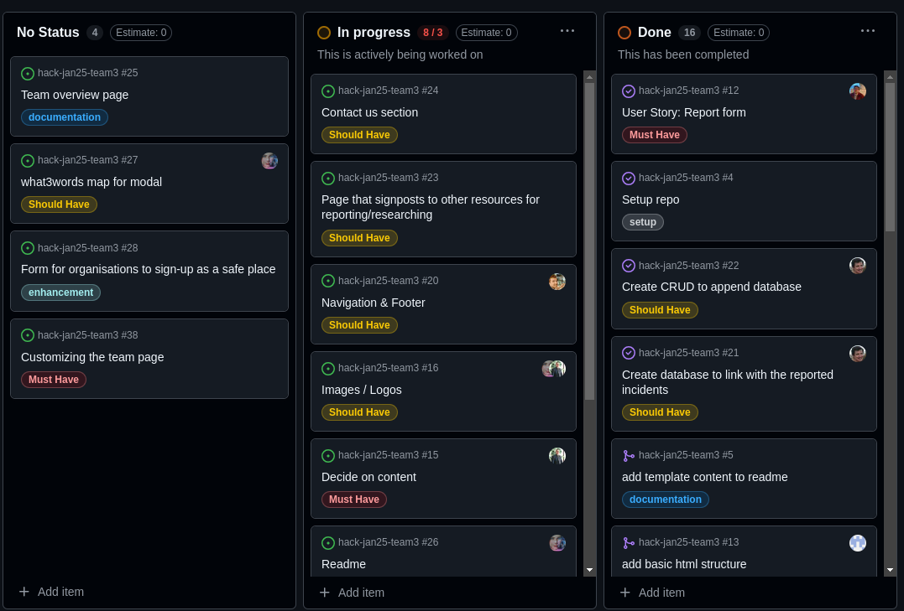

# Wireframes

Wireframe - Mobile - Front Page & Report 
  

 

Wireframe - Mobile - Contact Us Page  
  

 

Wireframe - Mobile - Resourse Page  
  

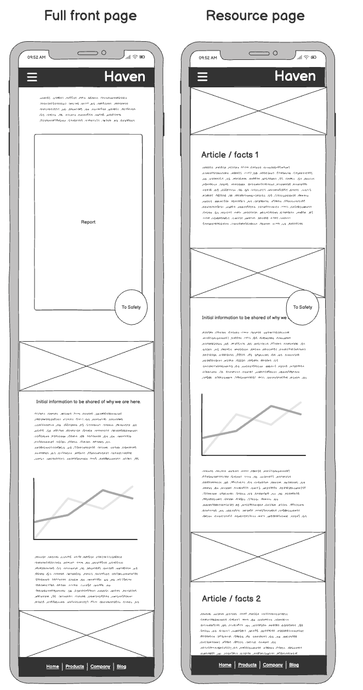

 

Wireframe - Mobile - Desktop home page 
  

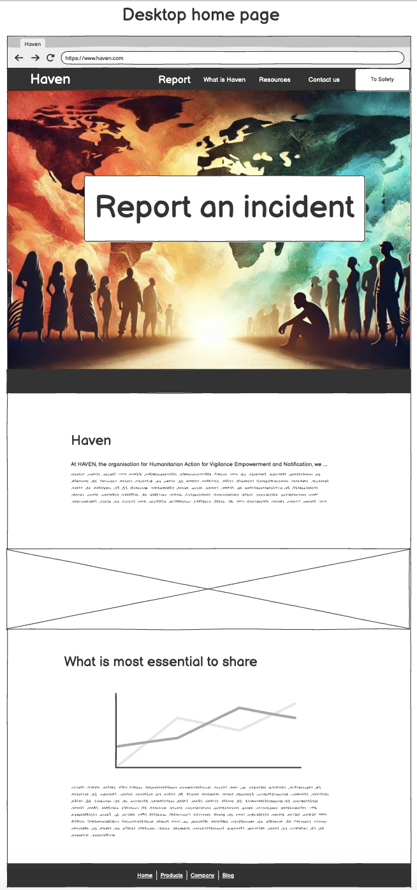

 

[Back to Table of Contents](#table-of-contents)

---

# Design

  # Colour Scheme

  

  # Typography

[Montserrat](https://fonts.google.com/specimen/Montserrat)

[Lato](https://fonts.google.com/specimen/Lato)

[Back to Table of Contents](#table-of-contents)

---

# Features

### Navbar
 
 

### Hero Image

 

### Footer

 

### To Safety Button
Our website includes a floating "To Safety" button designed to protect users in potentially dangerous situations. When clicked, the user is redirected to a different website, and their browsing history is cleared. This ensures that no one can trace their visit to our website.

### Reporting Form
To assist individuals who have been taken or are being held against their will—or anyone who has encountered someone in need of help—we have provided a report form. This form includes:

1. **Description Box**:
- There is a large text box where you can type in detailed information about what is happening. For example, you can describe the situation or share any important observations.

2. **Using the Map to Add a Location**:
- The map starts with a marker placed in **Dublin** by default.
- There’s a button that lets you set the marker to your current location. To use this, you will need to allow your browser to access your location. The marker will then move to where you are.
  - You can also drag the marker on the map to place it exactly where the event is happening.
- The coordinates are saved and are automatically included when you submit the form.

3. **Contact Preferences**:
- You can choose whether or not you want to be contacted after submitting the form. If you prefer to stay anonymous, you can. This allows you to share information in the way that feels safest for you.

4. **How to Use It**:
- Start by typing the details of the situation in the description box.
- Then, use the map to add a location by either clicking the button to set your current location or dragging the marker to the right spot.
- Submit the form containing the information you provided, including the location
- Choose whether you want to be contacted or not.
- If you do fill out the Contact details and submit the your details.

Report Form - Report incident 
  

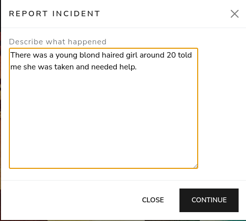

 

Report Form - Location 
  

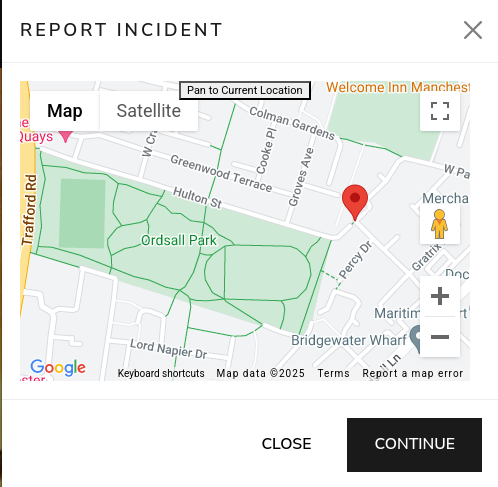

 

Report Form - Information to be submitted 
  

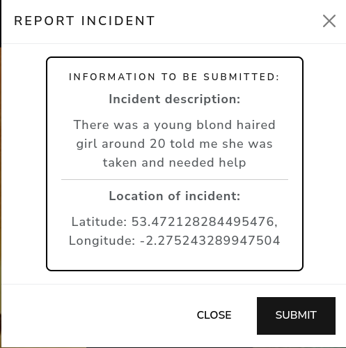

 

Report Form - Can we contact you? 
  

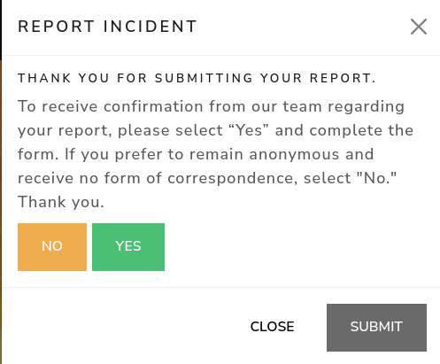

 

Report Form - Contact Information 
  

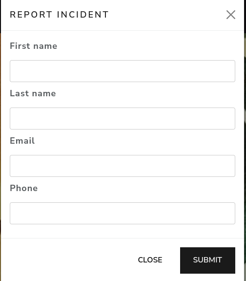

 

### Database 
- The database for this iste is hosted [here](https://github.com/gwhitdev/haven-app-database-crud)

### Desktop View

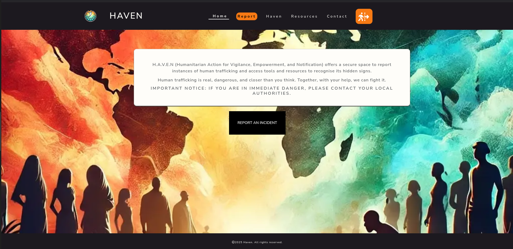

### Tablet View

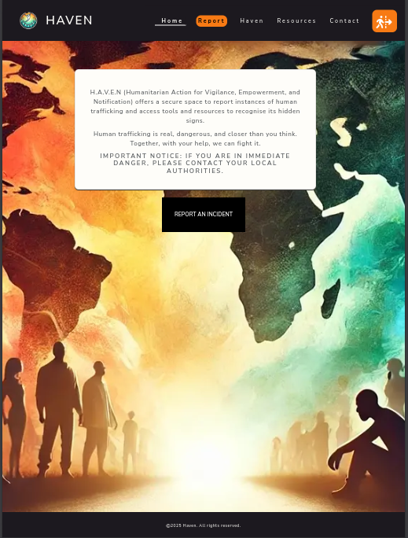

### Mobile View

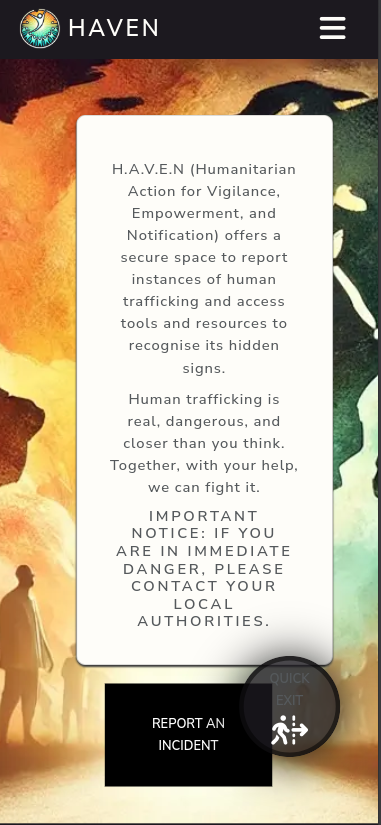

[Back to Table of Contents](#table-of-contents)

---

# **Goal**   

The primary goal of this project is to create a secure, user-friendly, and educational platform that raises awareness about human trafficking and supports individuals in taking action. The website will achieve this by integrating a reporting system and resources designed to empower users, maintain privacy, and connect them with the appropriate support systems.  

### Key Goals:
1. **Awareness and Education**:  
   - Provide resources to inform users about human trafficking and its impact.  
   - Signpost users to additional resources for reporting and researching the issue.  

2. **Reporting and Support**:  
   - Develop a report form that allows users to describe incidents and pinpoint locations using the What3Words API.  
   - Offer the option for users to remain anonymous or provide contact details for follow-up by authorities.  

3. **User Safety and Accessibility**:  
   - Include a quick exit button ("To Safety") to protect user privacy by redirecting them to another site and clearing their browsing history.  
   - Ensure the site is easy to navigate with clear sections for reporting, educational resources, and organizational information.  

4. **Functionality and Design**:  
   - Integrate a database to store reported incidents securely, with CRUD functionality to manage data.  
   - Design wireframes to guide the layout of key pages such as the landing page, navigation, footer, and contact sections.  
   - Use images, logos, and favicons to enhance the visual appeal and branding of the site.  

## Problem Statement  
Human trafficking remains a pervasive global issue, affecting millions of people and often operating unnoticed within communities. Many victims lack accessible tools to report their situation or seek help, and witnesses often don't know how to act. Additionally, the lack of awareness surrounding human trafficking leaves many unaware of its severity and prevalence.  

## Objective(s)  
- To create a secure and user-friendly platform that raises awareness about human trafficking and modern slavery.  
- To provide a safe space for victims and witnesses to report incidents while maintaining their privacy and anonymity.  
- To offer educational resources for users to understand and combat human trafficking.  
- To support authorities and organizations with detailed, actionable data collected through reports.  

## Target Audience  
- Victims of human trafficking seeking help or a way to report their situation.  
- Witnesses or concerned individuals looking to report incidents anonymously.  
- Organizations working to combat human trafficking and provide safe spaces.  
- General users seeking to educate themselves about human trafficking and its prevention.  

## Benefits  
- **Empowerment**: Victims and witnesses are provided with tools to take action safely and anonymously.  
- **Awareness**: Users gain access to valuable resources, increasing public knowledge about human trafficking.  
- **Safety**: Features like the "To Safety" button prioritize user privacy and security.   
- **Impactful Reporting**: Reports submitted via the platform include detailed descriptions and geolocation, offering actionable insights for authorities.  

[Back to Table of Contents](#table-of-contents)

---

# Deployment

GitHub was used to deploy the website. These were the steps taken to acheive this:

1. Log in to your GitHub account.
2. Navigate to the project repository.
3. Click the Settings tab near the top of the page.
4. In the left-hand menu, click on Pages.
5. Under the Source section:
    - Select main from the drop-down menu labeled "Branch."
    - Choose root from the folder drop-down menu.
6. Click Save.
7. After a few moments, your project will be live, and a link to the live page will appear at the top of the screen.

[Back to Table of Contents](#table-of-contents)

---

## Future Features  

As the platform evolves, we aim to introduce additional features to enhance its functionality and expand its impact.  

### 1. **Safe Place Registration Form**  
We plan to develop a dedicated form where organizations can register themselves as designated safe spaces for victims of human trafficking. This form will include:  
- Basic organizational details such as name, address, and contact information.  
- Descriptions of the services offered (e.g., shelter, legal aid, counseling).  
- Verification steps to ensure the authenticity and reliability of listed organizations.  

### 2. **Safe Places Directory Page**  
A dynamic page will be created to display a directory of registered safe places. This page will include:  
- **Search by Location**: Users will be able to search for safe spaces near them using a location-based filter.  
- **Map Integration**: A visual map with pins representing the locations of registered organizations.  
- **Detailed Information**: Each organization listing will include a brief overview, contact details, and available services.  
- **User Feedback**: Option for users to provide feedback or reviews on listed safe spaces to maintain accountability.  

### 3. **Enhanced User Support**  
- Integration of location-based services to provide users with real-time suggestions for nearby safe places.  
- Collaboration tools for organizations to communicate and coordinate with one another directly through the platform.  

These features aim to create a robust support network and ensure that victims have easy access to trusted resources when they need them most.  

 
 [Back to Table of Contents](#table-of-contents)

---

# Tech Stack

## Languages Used 
- HTML
- CSS
- JavaScript

## Frameworks, Libraries, Technologies & Programs Used
- Bootstrap
- NodeJS
- ExpressJS

[Back to Table of Contents](#table-of-contents)

---

# Testing

## HTML Validation

### index.html

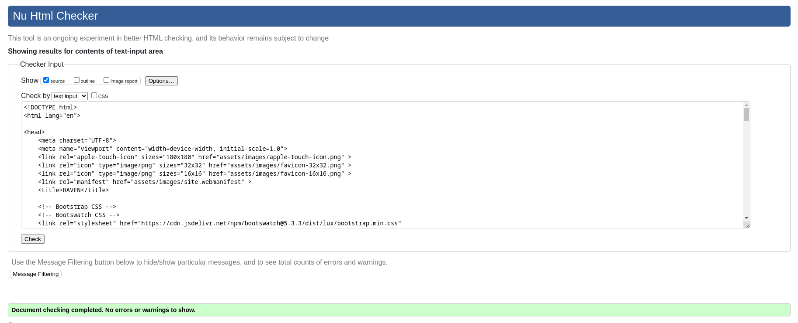

### haven.html

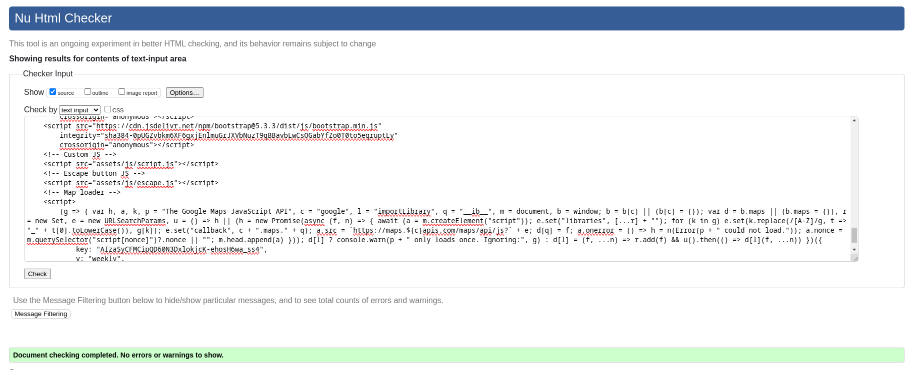

### resources.html

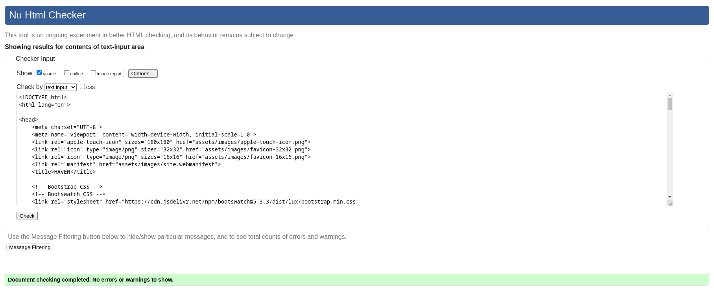

### contact.html

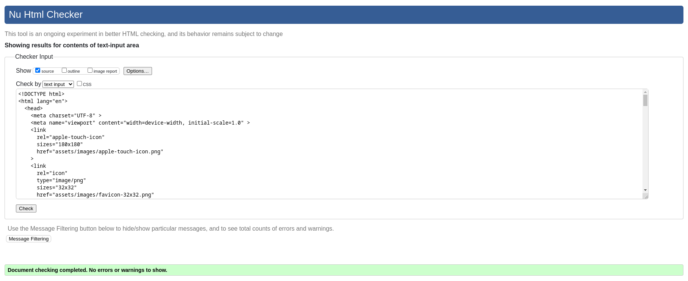

## CSS Validation

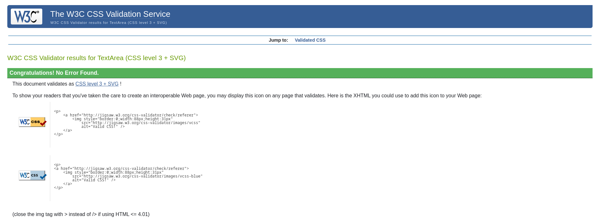

## JS Validation

### script.js

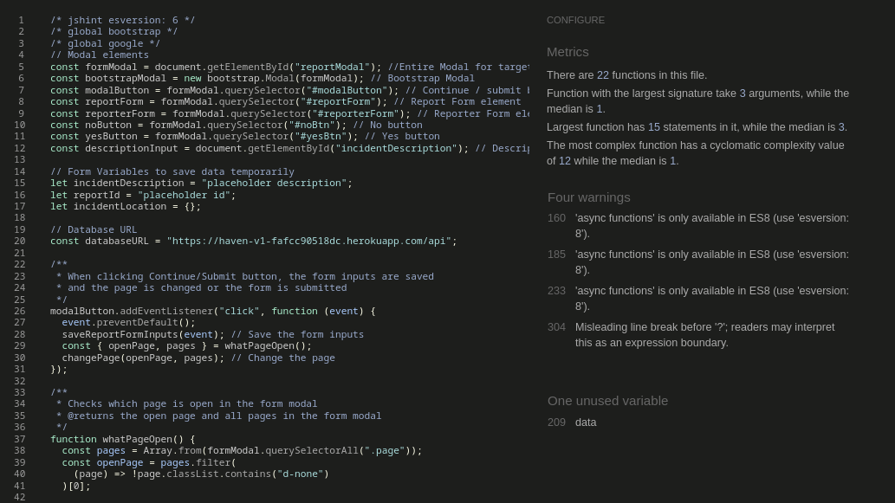

- one unused variable error 
  - This is used and is called in a separate file.

### escape.js

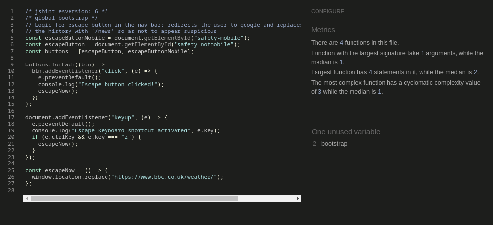

## Lighthouse 

[Back to Table of Contents](#table-of-contents)

---

# **🌟 Credits** 

- ChatGPT for genarating images for the site.
- Code Institute - Nav inspired from Lve Running project.
- [eurostat](https://ec.europa.eu/eurostat/statistics-explained/index.php?title=Trafficking_in_human_beings_statistics) for the graphs 
- 

[Back to Table of Contents](#table-of-contents)

---
 
# Team

## 404 Freedom Not Found

| Name | Github | LinkedIn |
| --- | --- | --- |
| Ian O'Connor | [Github](https://github.com/IanOC1994) | [LinkedIn](https://www.linkedin.com/in/ianoconnor1994/) |
| Sarah Darlington | [Github](https://github.com/Sazzzel) | [LinkedIn](https://www.linkedin.com/in/sarah-darlington-dev/) |
| Mikael Johnsson | [Github](https://github.com/mikael-johnsson) | [LinkedIn](https://www.linkedin.com/in/mikael-johnsson/) |
| Maarten Ridder | [Github](https://github.com/MJRidder) | [LinkedIn](https://www.linkedin.com/in/maartenridder1/) |
| Gareth Whitley | [Github](https://github.com/MJRidder) | [LinkedIn](https://www.linkedin.com/in/maartenridder1/) |
| William Waldron-Hyden | [Github](https://github.com/Will-WHyd) | [LinkedIn](https://www.linkedin.com/in/william-waldron-hyden/) |

[Back to Table of Contents](#table-of-contents)